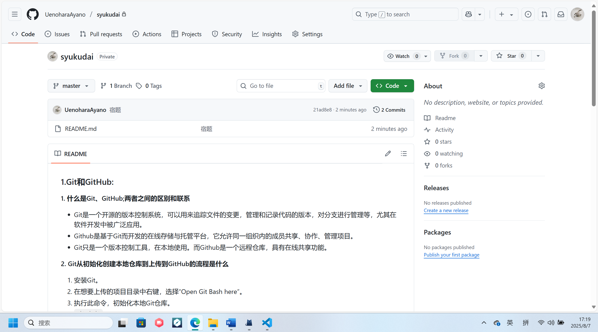

### 1.Git和GitHub:  
**1. 什么是Git、GitHub;两者之间的区别和联系**  
- Git是一个开源的版本控制系统，可以用来追踪文件的变更，管理和记录代码的版本，对分支进行管理等，尤其在软件开发中被广泛应用。  
- Github是基于Git而开发的在线存储与托管平台，它允许同一组织内的成员共享、协作、管理项目。  
- Git只是一个版本控制工具，在本地使用。而Github是一个远程仓库，具有在线共享功能。

**2. Git从初始化创建本地仓库到上传到GitHub的流程是什么**  
1. 安装Git。  
2. 在想要上传的项目目录中右键，选择“Open Git Bash here”。  
3. 执行此命令，初始化本地Git仓库。  
`git init`  
4. 再输入`git add .`将当前文件下的所有文件添加到暂存区。  
5. 再输入`git commit -m "提交信息"`提交文件到本地仓库。  
6. 登录Github，创建一个新仓库。  
7. 输入`git remote add origin https://github.com/用户名/仓库名.git`将远程仓库与本地仓库关联。<br>这里的链接为Github上创建的仓库的链接。  
8. 输入`git push -u origin master`将本地仓库文件推送至Github的远程仓库。  

**3. 本地仓库如何创建新的分支**  
1. 在想要创建新的分支的项目目录中右键，选择“Open Git Bash here”。  
2. 输入`git branch 新分支名称`创建一个新的分支。  
3. 创建完成后，可以用`git checkout 新分支名称`来切换到该分支。

**4. 如何修改本地仓库的远程连接**
1. 用`git remote -v`查看当前的远程连接。
2. 用以下代码修改远程连接：
`git remote set-url origin https://github.com/新用户名/新仓库.git`

**5. 如果我在创建仓库的时候选择了添加READEME,后续会出现什么问题，该如何解决**
- 问题：当你尝试将本地仓库推送到Github时，会报错，推送失败。  
- 解决：从Github上将README文件下载至本地仓库  
`git pull origin master --allow-unrelated-histories`  
再输入`git push origin master`将本地仓库重新推送至Github


### 2.Markdown:   
#### <center><font face="楷体" color=green>关于用Markdown写学习总结这档事</font></center>  
<font face="楷体">初学Markdown，操作还有些生疏，但是还是得硬着头皮写。  

今天是关于控制组常用软件的培训，讲了Git的基本知识、安装、配置啥的。还有Github的注册与配置，我学会了如何将Git与Github相连接，将本地仓库文件推送至Github。

然后还讲了VScode、Markdown、Notion、Keil、CubeMX、Dev-C++软件的安装与配置，因为我都装好了，故不再赘述。

然后写一个代码块：  
```cpp
#include<stdio.h>
int main()
{
    printf("Hello world!\n");
    return 0;
}
```  
|软件|安装情况|
|:--:|:--:|
|Git|√|
|VScode|√|
|Markdown|√|
|Notion|√|
|Keil|√|
|CubeMX|√|
|Dev-C++|√|

