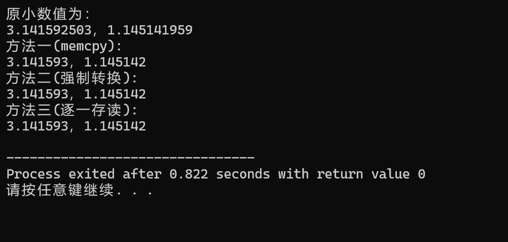

## 第4题  
 编程：使用至少三种方法，将两个float类型的小数存入一个长度为8的char数组中。再从该数组中提取出这两个float类型的小数，比较使用不同方法提取出的小数和原来数字之间的差距。  
#### 本题使用的三种方法分别为：  
1. 用`memcpy`直接将两个小数复制到数组中。
2. 用`(float *)`强制类型转换。
3. 将数值逐字节写入`char`数组中。

##### 方法一：
```c
	memcpy(dest,&a,sizeof(a));
	memcpy(dest + sizeof(a),&b,sizeof(b));
	memcpy(&o1,dest,sizeof(o1));
	memcpy(&o2,dest + sizeof(o1),sizeof(o2));
```
直接将小数a，b的值拷贝到数组dest中，再用同样的方法提取。

##### 方法二：  
```c
	*(float*)dest=a;
	*(float*)(dest+sizeof(a))=b;
	o3=*(float*)dest;
	o4=*(float*)(dest+sizeof(a));
```
对数组dest的类型进行强制转换，再写入a,b的值，代码比方法一简单，但强制转换要注意指针问题，要不然容易莫名其妙报错。

##### 方法三：
```c
unsigned char *p=(unsigned char*)&a;
	for(i=0;i<sizeof(a);i++)
	{
		dest[i]=p[i];
	}
	p=(unsigned char*)&b;
	for(i=0;i<sizeof(b);i++)
	{
		dest[i+sizeof(a)]=p[i];
	}
	p=(unsigned char*)&o5;
	for(i=0;i<sizeof(a);i++)
	{
		p[i]=dest[i];
	}
	p=(unsigned char*)&o6;
	for(i=0;i<sizeof(b);i++)
	{
		p[i]=dest[i+sizeof(a)];
	}
```
定义字符指针*p，逐字节将`float`数据写入`char`数组。代码较长。

##### 输出结果：

可以看到提取出来的数与原数都有差距，但三种方法的差距都一样大。

##### 代码：
```c
#include <stdio.h>
#include <string.h>
int main()
{
	float a=3.1415926f;
	float b=1.145141919f;
	float o1,o2,o3,o4,o5,o6;
	char dest[8];
	int i;
	
	
	memcpy(dest,&a,sizeof(a));
	memcpy(dest + sizeof(a),&b,sizeof(b));
	memcpy(&o1,dest,sizeof(o1));
	memcpy(&o2,dest + sizeof(o1),sizeof(o2));
	
	
	*(float*)dest=a;
	*(float*)(dest+sizeof(a))=b;
	o3=*(float*)dest;
	o4=*(float*)(dest+sizeof(a));
	
	
	unsigned char *p=(unsigned char*)&a;
	for(i=0;i<sizeof(a);i++)
	{
		dest[i]=p[i];
	}
	p=(unsigned char*)&b;
	for(i=0;i<sizeof(b);i++)
	{
		dest[i+sizeof(a)]=p[i];
	}
	p=(unsigned char*)&o5;
	for(i=0;i<sizeof(a);i++)
	{
		p[i]=dest[i];
	}
	p=(unsigned char*)&o6;
	for(i=0;i<sizeof(b);i++)
	{
		p[i]=dest[i+sizeof(a)];
	}
	
	printf("原小数值为：\n%.9f，%.9f\n",a,b);
	printf("方法一(memcpy):\n%.6f，%.6f\n",o1,o2);
	printf("方法二(强制转换):\n%.6f，%.6f\n",o3,o4);
	printf("方法三(逐一存读):\n%.6f，%.6f\n",o5,o6);
	
	return 0;
}
```