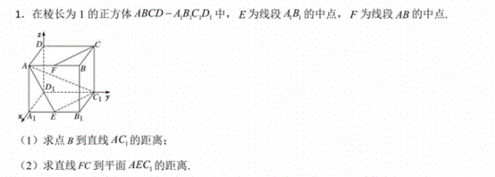
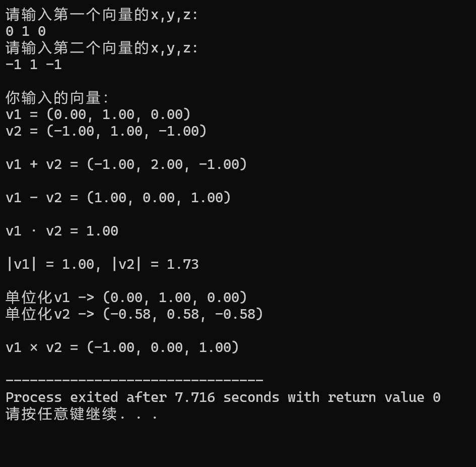
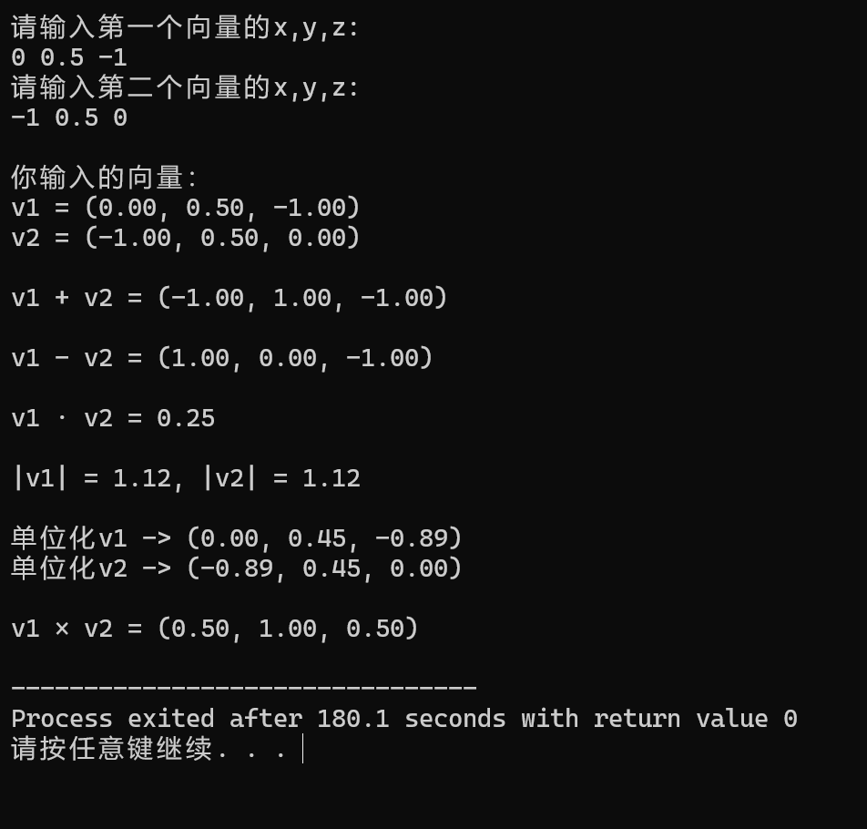

## 第5题  
编程：写一个含有x、y、z三个float元素的三维向量结构体，结构体命名为vector3f，围绕它写一个运算库（每个函数都要写注释哦），实现三维向量的加、减、点乘、单位化、求模与叉乘。

本题得分成`.h`头文件与`.c`头文件来编写。在`.h`文件中对函数进行声明，在`vector3f.c`文件中编写函数实现，在`main.c`中对函数进行调用，对键入的向量值进行运算。

运算库总共有六种运算：  
##### 1. 三维向量的加法运算
在运算库中，加法运算被定义为`vector_add`，在`vector3f.c`文件中给出了运算代码。
```c
vector3f vector_add(vector3f a,vector3f b)				//向量和运算
{
	vector3f c;
	c.x = a.x + b.x;
	c.y = a.y + b.y;
	c.z = a.z + b.z;
	return c;
}
```
返回值c为和向量。  
##### 2. 三维向量的减法运算  
减法运算被定义为`vector_sub`,运算代码为：
```c
vector3f vector_sub(vector3f a,vector3f b)				//向量差运算
{
	vector3f c;
	c.x = a.x - b.x;
	c.y = a.y - b.y;
	c.z = a.z - b.z;
	return c;
}
```  
这里的返回值c为差向量。  
##### 3. 三维向量的点乘运算  
点乘运算被定义为`vector_dot`,运算代码为：
```c
float vector_dot(vector3f a,vector3f b)					//向量点乘运算
{
	return a.x*b.x+a.y*b.y+a.z*b.z;
}
```
直接将运算值作为点乘结果返回。
##### 4. 三维向量的单位化运算  
单位化运算被定义为`vector_re`,运算代码为：
```c
vector3f vector_re(vector3f a)							//向量单位化运算
{
	float m=vector_length(a);
	if(m==0.0)
	{
		return vector_create(0.0,0.0,0.0);				//防止0作为分母
	}
	return vector_create(a.x/m , a.y/m , a.z/m);
}
```
注意这里要判断向量自身是否为0，防止0作为分母报错。
##### 5. 三维向量的模运算  
模运算被定义为`vector_length`,运算代码为：
```c
float vector_length(vector3f a)							//向量模运算
{
	return sqrt(a.x*a.x + a.y*a.y + a.z*a.z);
}
```
##### 6. 三维向量的叉乘运算  
叉乘运算被定义为`vector_cross`,运算代码为：
```c
vector3f vector_cross(vector3f a,vector3f b)			//向量叉乘运算
{
	return vector_create(a.y*b.z - a.z*b.y , a.z*b.x - a.x*b.z , a.x*b.y - a.y*b.x);
}
```

**六个板块的运算代码如上。**


**对于这个题目，利用该运算库可以很快得出结果**
1. 点B到直线AC1的距离为 AB·AC1。<center></br>AB = (0, 1, 0)</br>AC1 = (-1, 1, -1)</center>  
将值代入，可以得到：  
  
故距离为 $\frac {|AB × AC1|}{|AC1|}$ = $\sqrt 2$ / $\sqrt 3$ </br>

2. 先算平面AEC1的法向量

再运算有距离为 $\sqrt 3$ / 6