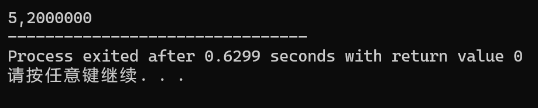

#### 1. 简述堆区和栈区的区别
**栈区**：定义的函数传入形参或局部变量被调用，它们会先在栈里分配一个空间，在它们生命周期结束之后就释放。栈是编译器直接控制分配和释放的空间。栈为向下生长（高地址→低地址）。

**堆区**：堆和栈相反，分配的新的内存向上生长（低地址→高地址）。堆的内存是程序员在编写程序时自己分配的。

堆区的内存在分配时容易出现碎片化，而栈区的内存很少出现这种情况。

#### 2. 见编程文件

#### 3. 见编程文件

#### 4. 见编程文件

#### 5. 简述出现野指针的可能原因和相应的避免方法。  
**可能原因**：
1. 指针未初始化就被使用
```c
int *p; // 未初始化
*p = 10;
```
2. 指针释放后继续使用
```c
free(p);
*p = 10;
```
3. 指针越界访问
```c
int num[3] = {1, 2, 3};
int *p = num;
printf("%d\n", *(p + 5));
```
4. 返回局部变量的地址
```c
int* func() {
    int x = 10;
    return &x; // 函数结束后 x 已销毁
}
```
**避免方法**：
1. 定义指针时立即初始化
```c
int *p = NULL;
```
2. 释放内存后将指针置为`NULL`
```c
free(p);
p = NULL;
```
3. 编写程序时注意数组和指针的边界
4. 不要返回局部变量的地址

#### 6. 分析该程序运行后的输出结果。
```c
int main()
 {
 int arr[5] = { 1, 2, 3, 4, 5};
 int* ptr1 = (int*)(&arr + 0x1);
 int* ptr2 = (int*)((long long)arr + 0x1);
 printf("%x,%x", ptr1[-1], *ptr2);
 return 0;
 }
```
**运行结果如下**：

1. 先对数组进行初始化：
`int arr[5] = { 1, 2, 3, 4, 5};`

2. 对`ptr1`进行计算
`int* ptr1 = (int*)(&arr + 0x1);`
`&arr`的类型为`int(*)[5]`,指向整个数组。故`&arr + 0x1`会跳过完整的数组，故`ptr1`指向的是数组末尾的外面。`ptr1[-1]`对应的是数组末尾`arr[4]`=5

3. 对`ptr2`进行计算
- `arr`退化为`int*`，值为`0×1000`。
- `(int)arr`强制转成整数后，加1字节`0×1`。
- 再强制转回`int*`，即`ptr2`指向`0×1001`。
- 再从`0×1001`开始读取4个字节（小端）
内存: [0x1001]=00, [0x1002]=00, [0x1003]=00, [0x1004]=02
故读出0x02000000

4. 打印出来为
```c
5,2000000
```

#### 7. 我们可以用#define定义常量，为什么要用枚举？
1. `#define`定义的常量无类型，在`int`、`char`、`float`里都不会报错。
`enum`定义的是有类型的常量，其实际上是`int`类型。
2. `#define`是全局替换，在整个编译器里都有效，可能会产生命名冲突。
`enum`定义的常量可以限制在函数内，互不干扰。
3. `#define`是纯文本替换，编译器没有将其视为“常量”
`enum`是编译器直接生成的常量，处理效率更高，更不易出错。
4. `enum`可以一次性定义一组常量,`#define`就要一行一行写。