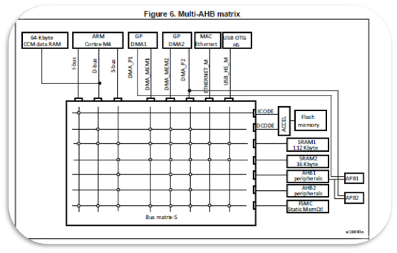
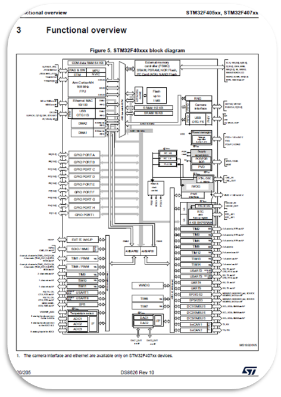
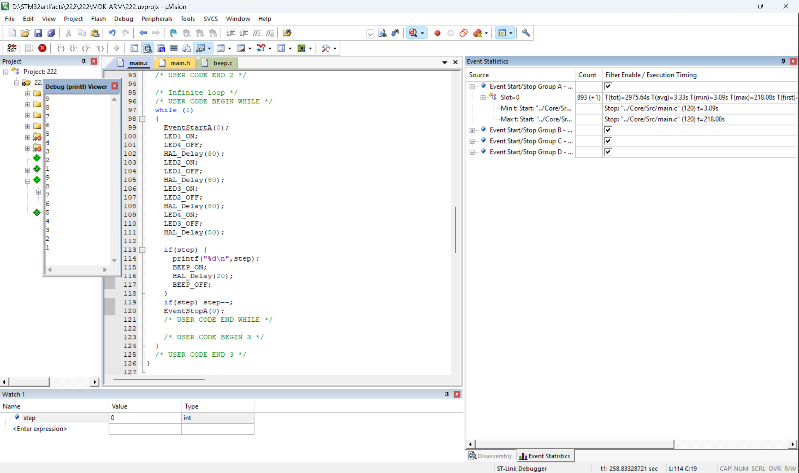

# 08-12 笔记

## 1. 总线 (Bus)

### 总线类型
- **AHB 总线矩阵**
  - **总线主设备 (Bus Masters)**: 能发起数据读/写请求的单元  
    例：CPU、DMA 控制器等
  - **总线从设备 (Bus Slaves)**: 响应主设备请求的单元  
    例：外设、RAM、Flash
- **APB 总线**
  - 低速外设挂载总线（如 GPIO、USART、定时器等）
- **RAM**
  - 一般容量够用，实际开发中很难用尽
- **参考资料**
  - 在参考手册中可查型号差异与总线挂载情况

  
显示了 AHB、APB 以及各外设的挂载关系，这种挂载关系决定了外设寄存器访问延迟与总线带宽分配。因此也造成了不同外设访问的速度差异。

---

## 2. 时钟 (Clock)

### 时钟系统
- **PLL (Phase Locked Loop)**
  用于将外部高速晶振（HSE）倍频到系统所需高性能时钟
- **CSS (Clock Security System)**
  时钟安全系统，当 HSE 失效时，自动切换到安全时钟源，防止系统崩溃
- **系统时钟**
  系统时钟是 MCU 的“心跳”，决定所有外设与核心的运行节奏

**以下为各种时钟源：**  

| 时钟源 | 本质             | 典型频率       | 精度/稳定性 | 功耗 | 核心用途 |
| ------ | ---------------- | -------------- | ----------- | ---- | -------- |
| HSI    | 内部 RC 振荡器   | 16 MHz         | 低          | 中   | 默认启动时钟、低成本应用、CSS 备用 |
| HSE    | 外部晶体/时钟    | 4–26 MHz       | 高          | 中   | PLL 输入源、高性能系统、精密通信 |
| LSI    | 内部低功耗 RC    | ~32 kHz        | 非常低      | 极低 | 独立看门狗 (IWDG)、RTC（不推荐） |
| LSE    | 外部 32.768kHz 晶体 | 32.768 kHz     | 极高        | 极低 | 实时时钟 (RTC) |
| PLL    | 频率合成器       | 高达 168 MHz   | 依赖输入源  | 高   | 生成高速系统时钟 (SYSCLK) |

这张图展示了时钟树（Clock Tree），也标明了各时钟源（HSE、HSI、PLL等）及它们的分频/倍频关系。可以帮助我们更好地理解外设时钟频率的计算方式。

---

## 3. 堆栈与启动过程 (Stack & Startup)

### 堆栈初始化
- **SP（Stack Pointer）**
  - 上电后，BOOT 引脚决定启动模式  
  - MCU 从 Flash 的起始位置读取 **栈顶地址**（Stack Top Address）  
  - 将该值加载到 **SP**
- **PC（Program Counter）**
  - 向量表中的复位向量（Reset Vector）会被装入 **PC**
  - CPU 从该地址开始执行程序

### 启动过程
1. **上电复位**
2. **BOOT 引脚决定启动介质**（Flash / SRAM / 系统引导）
3. 从启动介质的 0x0000 位置读取：
   - 栈顶地址 → SP
   - 复位处理函数地址 → PC
4. 执行启动文件（`startup_xx.s`），完成：
   - 数据段初始化
   - BSS 段清零
   - 调用 `main()` 函数

## 4.大作业运行结果：

