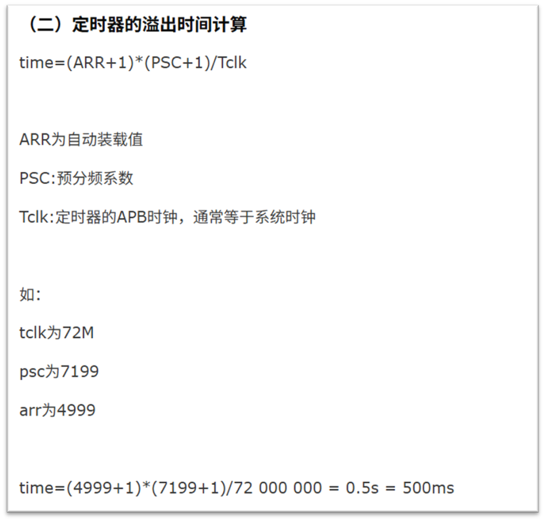

# 08-13 笔记

## 1. NVIC（内嵌向量中断控制器）

### 核心作用

- 管理中断的**优先级**、**响应顺序**、**嵌套处理**。
- 中断可异步触发，硬件发出 IRQ 请求。
- 进入中断时，内核自动保存部分寄存器。
中断处理结束后，返回被打断的程序位置继续执行。

### 优先级机制

1. **抢占优先级**  
   - 高抢占优先级可打断低抢占优先级（支持嵌套）。
2. **响应优先级**  
   - 抢占优先级相同时，高响应优先级先执行。  
   - 响应优先级不支持嵌套（需等当前中断结束）。
3. **特殊中断**  
   - Reset、NMI、Hard Fault 优先级为负数，固定且不可更改。
4. **优先级数值**  
   - 数字越小代表优先级越高。

---

## 2. TIM（定时器）

### 分类

- 高级定时器（如 TIM1、TIM8）
- 通用定时器（如 TIM2、TIM3）
- 基础定时器（如 TIM6、TIM7）
- 专用定时器 **SysTick**（内核）  

**TIM2和TIM5是32位定时器，其它都是16位定时器。**

### 关键寄存器

- **TIMx_PSC**（预分频器）：用于设置定时器的分频。（如 168 MHz 的主频设定为 84 MHz）。
- **TIMx_CNT**（计数器）：存储当前计数值。
- **TIMx_ARR**（自动重载）：设定CNT计数寄存器计数上限，达到上限时触发溢出并重计数。

### 计数模式

1. **向上计数**：0 → ARR → 溢出
2. **向下计数**：ARR → 0 → 溢出
3. **中心对齐**：上升到 ARR-1，再下降到 1，双溢出

### 通用定时器功能

- 4 独立通道（CH1~CH4）可配置为：
  - 输入捕获
  - 输出比较
  - PWM 生成（边缘/中心对齐模式）
  - 单脉冲模式输出

---

## 3. TIM-PWM（脉冲宽度调制）

### 原理

- 通过改变**高电平持续时间占一个完整周期的百分比（占空比）**来调节平均输出电压或功率。
- 常用来控制模拟量的等效输出（例如调节亮度、速度、功率）。

### 模式

- **边缘对齐模式**：PWM 波形在周期起始或结束位置切换。
- **中心对齐模式**：PWM 波形在计数器上升与下降中间点切换（适用于对称波形需求）。

---
